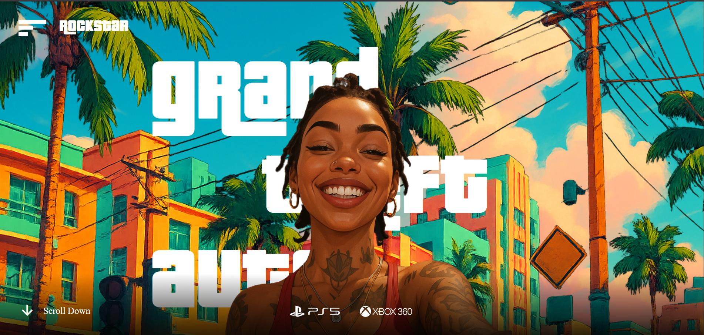

# 🎮 GTA 6 Landing Page

A high-impact, responsive landing page inspired by Rockstar's **GTA VI**, built with **React.js**, **Tailwind CSS**, **GSAP**, and **JavaScript**. This project captures the bold visual style of GTA with cinematic transitions and smooth animations — perfect for fans and developers looking to explore frontend animation.

---

## 🚀 Live Demo

🌐 [View Live Site](https://gta-6-landing-page-three.vercel.app/)
It May take time for Loading Please Wait...
---

## 🛠️ Tech Stack

- ⚛️ **React.js** – Component-based frontend
- 🎨 **Tailwind CSS** – Utility-first responsive styling
- 🌀 **GSAP** – Smooth animations and transitions
- 📜 **JavaScript** – DOM logic and event control
- 💡 **Vite / CRA** – Fast dev environment (based on your setup)

---

## 📸 Screenshots




---

## 📁 Features

- 📱 Fully responsive design
- 🌀 GSAP-powered entrance animations
- 🕶️ Stylish dark theme, GTA-inspired
- 💻 Optimized for desktop & mobile

---

## 🔧 Installation

1. **Clone the Repository**
   ```bash
   git clone https://github.com/AshimChoudhary/gta-6-landing-page.git
   cd gta-6-landing-page

2. **Install Dependencies**
  npm install

3. **Start the Development Server**
  npm run dev  # or `npm start` if using CRA

4. **Build for Production**
  npm run build
